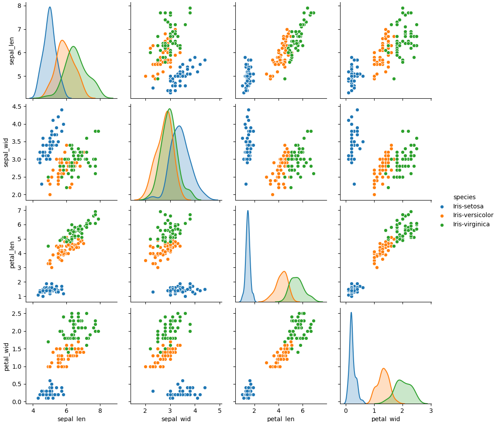
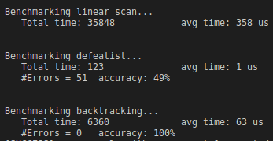
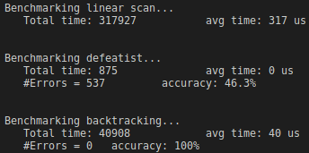

# TD2: K-Dimensional Tree (kd-tree)

## Overview

The goal of this TD(***travaux-dirigé***) is to implement the **kd-tree** data structure to solve the **k-nearest neighbor** problem. For querying, we consider both the **defeatist** and **backtracking** approaches and compare their performances.

The famous [iris data set](https://en.wikipedia.org/wiki/Iris_flower_data_set) is used for testing.

The folder contains the following files:

- the source file **retrieval.cpp** which contains the main code
- the header file **retrieval.hpp**
- the file **main.cpp**, which is used for the tests script
- a **Makefile** that you can use to compile these tests

It also contains some subdirectories:

- **csv** with the main dataset
- **grading** with the test scripts
- **gradinglib** with the test library.
- **quiz** with a ***Jupyter notebook*** file and plots obtained from the iris data set.
- **screenshots** with the performance comparisons between the **defeatist** and **backtracking** approaches.

## How to run the tests

Compile using the Makefile and then run **grader** executable generated.

`make grader`

`./grader`

