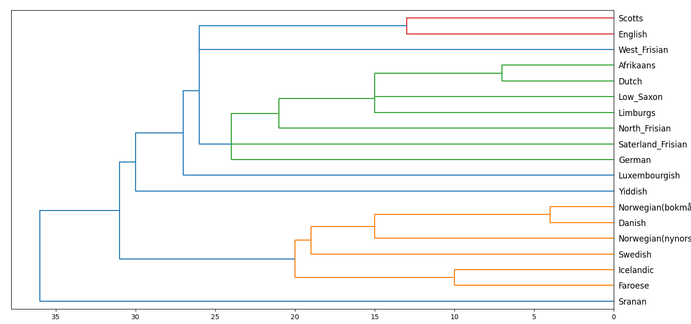

# TD4: Hierarchical Clustering

## Overview

The goal of this TD(***travaux-dirigé***) is to implement different strategies for **hierarchical clustering** such as **single-linkage**, **complete-linkage**, **average-linkage** and **Ward's Criterion**. For visualisation of the clustering process, dendrograms were used.

For example, the dendrogram below was built using the **languages** dataset. This dataset includes several Germanic languages and contains [lexical distances](https://linguistics.stackexchange.com/questions/17400/worldwide-map-or-data-for-linguistic-distance) between them.

The folder contains the following files:

- the source file **dendrogram.cpp** which contains 
- the source file **graph.cpp** which implements the graph data structure used in the clustering algorithms
- the source file **edge.cpp** which represents edges in the graph
- the source file **cloud.cpp** which represents the cloud of data points being analysed
- the source file **point.cpp** which represents a point in the dataset
- the file **main.cpp**, which is used for the tests script
- a **Makefile** that you can use to compile these tests

It also contains some subdirectories:

- **csv** with the main dataset
- **grading** with the test scripts
- **gradinglib** with the test library
- **quiz** with a python script used for preliminary analysis

## How to run the tests

Compile using the Makefile and then run **grader** executable generated.

`make grader`

`./grader`

